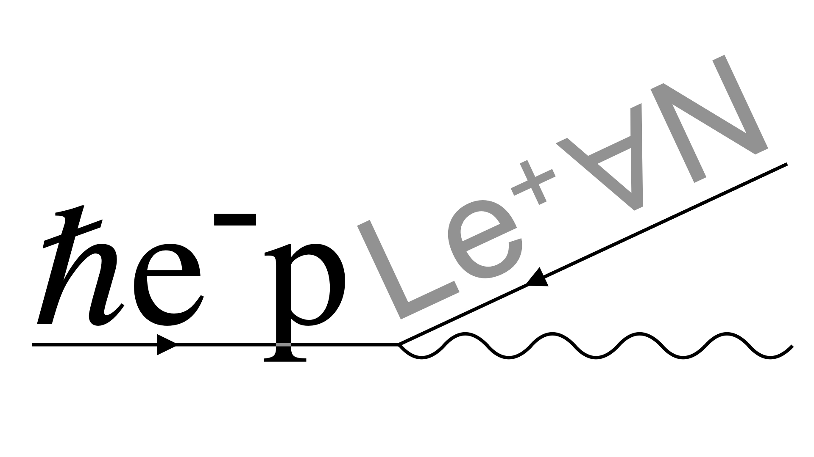

[](https://heplean.github.io/HepLean/)
[](https://heplean.github.io/HepLean/#how-to-get-involved)
[](https://leanprover.zulipchat.com)
[](https://heplean.github.io/HepLean/TODOList)
[](https://heplean.github.io/HepLean/InformalGraph)

[](https://heplean.github.io/HepLean/Stats)
[](https://github.com/leanprover/lean4/releases/tag/v4.15.0)
[](https://gitpod.io/#https://github.com/HEPLean/HepLean)

A project to digitalize high energy physics.

## Aims of this project

🎯 __Digitalize__ results (meaning calculations, definitions, and theorems) from high energy physics
into Lean 4.

🎯 Develop structures to aid the __creation__ of new results in high energy physics using Lean,
  with the potential future use of AI.

🎯 Create good documentation so that the project can be used for __pedagogical__ purposes.


## Some parts of HepLean
HepLean _currently_ includes, but is not limited to, the following parts:

__Lorentz [🗂️](https://heplean.github.io/HepLean/docs/HepLean/Lorentz/Group/Basic.html):__  The Lorentz group, Lorentz algebra, Weyl fermions, Real Lorentz vectors, complex Lorentz vectors, complex Lorentz tensors, bispinors, Pauli matrices, etc.

__Index notation [🗂️](https://heplean.github.io/HepLean/docs/HepLean/Tensors/OverColor/Basic.html) [📄](https://arxiv.org/abs/2411.07667):__  Formalization of index notation using category theory allowing commands like

```Lean
{A | μ ν ⊗ S | μ ν = - A | μ ν ⊗ S | μ ν}ᵀ
```

__Anomaly cancellation [🗂️](https://heplean.github.io/HepLean/docs/HepLean/AnomalyCancellation/Basic.html):__  Results related to solutions to the anomaly cancellation conditions of several theories.

__Standard Model physics [🗂️](https://heplean.github.io/HepLean/docs/HepLean/StandardModel/Basic.html):__ Properties of the Higgs potential.

__BSM physics [🗂️](https://heplean.github.io/HepLean/docs/HepLean/BeyondTheStandardModel/TwoHDM/Basic.html):__ Starts to: Georgi Glashow model, Pati-Salam, Spin(10), Two Higgs doublet model.

__Flavor physics [🗂️](https://heplean.github.io/HepLean/docs/HepLean/FlavorPhysics/CKMMatrix/Basic.html):__ Properties of the CKM matrix.

__Perturbation Theory [🗂️](https://heplean.github.io/HepLean/docs/HepLean/PerturbationTheory/FieldOpAlgebra/WicksTheorem.html):__ Time-dependent version of Wick's theorem for both fermions and bosons.

## Associated media and publications
- [📄](https://arxiv.org/abs/2405.08863) Joseph Tooby-Smith,
__HepLean: Digitalising high energy physics__, Computer Physics Communications, Volume 308,
2025, 109457, ISSN 0010-4655, https://doi.org/10.1016/j.cpc.2024.109457. \[arXiv:2405.08863\]
- [📄](https://arxiv.org/abs/2411.07667) Joseph Tooby-Smith, __Formalization of physics index notation in Lean 4__, arXiv:2411.07667
- [💻](https://live.lean-lang.org/#code=import%20Mathlib.Tactic.Polyrith%20%0A%0Atheorem%20threeFamily%20(a%20b%20c%20%3A%20ℚ)%20(h%20%3A%20a%20%2B%20b%20%2B%20c%20%3D%200)%20(h3%20%3A%20a%20%5E%203%20%2B%20b%20%5E%203%20%2B%20c%20%5E%203%20%3D%200)%20%3A%20%0A%20%20%20%20a%20%3D%200%20∨%20b%20%3D%200%20∨%20c%20%3D%200%20%20%3A%3D%20by%20%0A%20%20have%20h1%20%3A%20c%20%3D%20-%20(a%20%2B%20b)%20%3A%3D%20by%20%0A%20%20%20%20linear_combination%20h%20%0A%20%20have%20h4%20%3A%20%203%20*%20a%20*%20b%20*%20c%20%3D%200%20%3A%3D%20by%20%0A%20%20%20%20rw%20%5B←%20h3%2C%20h1%5D%0A%20%20%20%20ring%20%0A%20%20simp%20at%20h4%20%0A%20%20exact%20or_assoc.mp%20h4%0A%20%20%0A) Example code snippet related to Anomaly cancellation conditions.
- [🎥](https://www.youtube.com/watch?v=W2cObnopqas) Seminar recording of "HepLean: Lean and high energy physics" by J. Tooby-Smith

### Papers referencing HepLean
- Hu, Jiewen, Thomas Zhu, and Sean Welleck. "miniCTX: Neural Theorem Proving with (Long-) Contexts." arXiv preprint [arXiv:2408.03350](https://www.arxiv.org/abs/2408.03350) (2024). [Project page]( https://cmu-l3.github.io/minictx/)

How HepLean was used: *Theorems from the space-time files of HepLean were included in a data set used to evaluate the ability of models to prove theorems from real-world repositories, which requires working with definitions, theorems, and other context not seen in training.*

## Contributing

We follow here roughly the same contribution policies as MathLib4 (which can be found [here](https://leanprover-community.github.io/contribute/index.html)).

A guide to contributing can be found [here](https://github.com/HEPLean/HepLean/blob/master/CONTRIBUTING.md).

If you want permission to create a pull-request for this repository contact Joseph Tooby-Smith on the [Lean Zulip](https://leanprover.zulipchat.com), or email.

## Installation

If you want to play around with HepLean, but do not want to download Lean, then you can use [GitPod](https://gitpod.io/#https://github.com/HEPLean/HepLean).

### Installing Lean 4

Installation instructions for Lean 4 can be found:

- https://lean-lang.org/lean4/doc/quickstart.html

or

- https://leanprover-community.github.io/get_started.html

### Installing HepLean

- Clone this repository (or download the repository as a Zip file)
- Open a terminal at the top-level in the corresponding directory.
- Run `lake exe cache get`. The command `lake` should have been installed when you installed Lean.
- Run `lake build`.
- Open the directory (not a single file) in Visual Studio Code (or another Lean compatible code editor).

### Optional extras

- [Lean Copilot](https://github.com/lean-dojo/LeanCopilot) and [LLMLean](https://github.com/cmu-l3/llmlean) allow for the use of large language models in Lean
- [tryAtEachStep](https://github.com/dwrensha/tryAtEachStep) allows one to apply a tactic, e.g. `exact?` at each step of a lemma in a file to see if it completes the goal. This is useful for golfing proofs.
